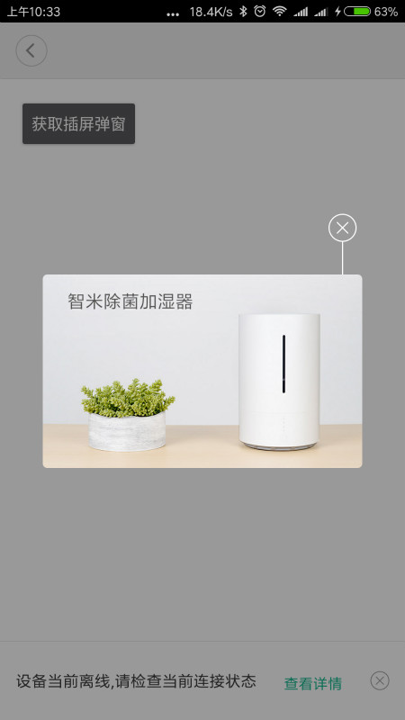
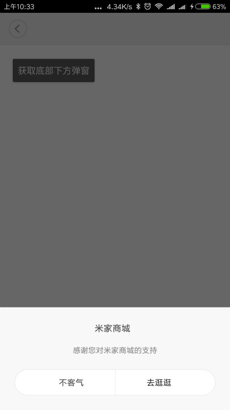

# 个性化运营接口描述文档

## 背景

我们定义了五种类型的个性化运营功能，分别为：插屏弹窗、页面下方弹窗、Banner广告、通知广告以及点击热区。

除点击热区外，其它四种类型的广告可以通过米家扩展程序接口，非常简单的集成到米家扩展程序页面中。

## 点击热区广告

点击热区广告泛指可点击跳转如商城页面，具有广告效应的自定义View。

点击热区广告的样式由米家扩展程序自行设计展示，跳转商城请调用以下接口：


```
/**
 * ApiLevel:3 打开商城页面
 *
 * @param gid
 */
public abstract void openShopActivity(String gid);
```

后续会增加广告展示的接口，用于统计广告的展示次数。

## 集成其他四种广告的准备工作

SDK版本 >= 32

开启广告支持

```java
/**
 * ApiLevel: 32 开启米家扩展程序广告的支持
 */
void enableAd();
```

```java
mHostActivity.enableAd();      //开启米家扩展程序广告
```

只需调用一次，建议进入米家扩展程序首页后开启

### 插屏弹窗

样式:



接口：

```java
/**
 * ApiLevel: 32 展示插屏弹窗广告
 */
void showPopAd();
```

调用示例：

```java
mHostActivity.showPopAd();
```

### 页面下方弹窗



接口：

```java
/**
 * ApiLevel: 32 展示页面下方弹窗
 */
void showBottomPopAd();
```

调用示例：


```java
mHostActivity.showBottomPopAd();
```

### Banner广告


接口：

```java
/**
 * ApiLevel: 32 创建Banner广告
 *
 * @param vAdContainer 用于展示广告View的ViewGroup
 */
void showBannerAd(ViewGroup vAdContainer);
```

调用示例：

```java
LinearLayout vBannerGroup = (LinearLayout) findViewById(R.id.ad_banner);
mHostActivity.showBannerAd(vBannerGroup);
```

### 通知广告


接口：

```java
/**
 * ApiLevel: 32 展示通知广告
 *
 * @param vAdContainer 用于展示广告View的ViewGroup
 */
void showNoticeAd(ViewGroup vAdContainer);
```

调用示例：

```java
LinearLayout vNoticeGroup = (LinearLayout) findViewById(R.id.ad_notice);
mHostActivity.showNoticeAd(vNoticeGroup);
```

## 注意事项：

1. 为了确保Banner广告和通知广告的展示样式符合规范，请设置ViewGroup参数的宽为match_parent,高为wrap_content。
2. 每种类型的广告最多只允许配置一个

## 常见问题

* 如何配置广告？

米家扩展程序广告的配置通过广告管理后台控制，暂不对外开放，如有广告配置需求，请联系相关工作人员。

* 为什么调取接口，看不到广告？

广告的展示依赖广告后台的正确配置和米家扩展程序的支持。

首先确保基础配置正确，如广告开关是否在调取广告前打开

```java
mHostActivity.enableAd();      //开启米家扩展程序广告
```

如果是Banner广告或通知广告，请确保作为参数的ViewGroup可见。

配置正确的话，可能由于网络原因导致广告请求失败，或者广告图片加载过慢，请多尝试几次。

如果仍未看到广告，请联系工作人员协助调试。
