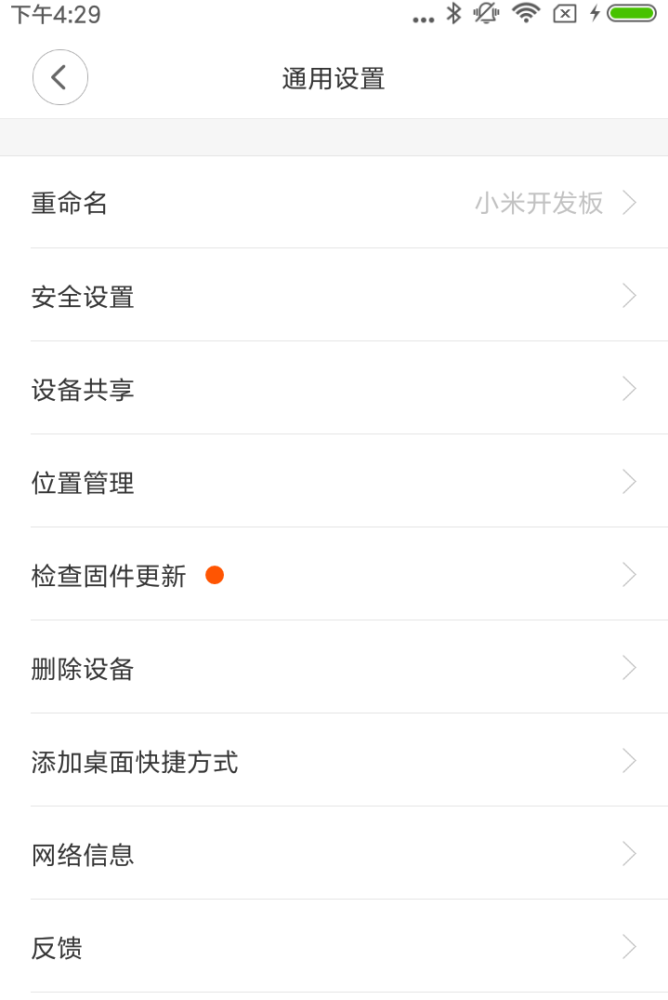
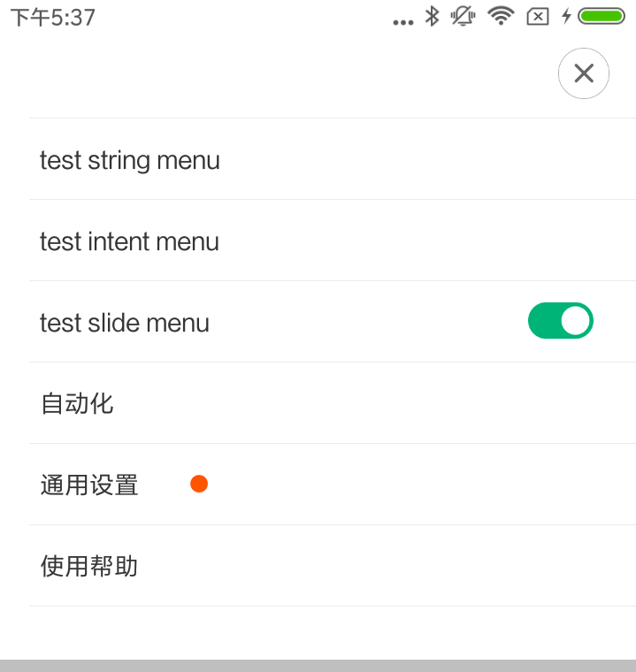

# 设备更多菜单API

## 米家提供的设备更多菜单样式

* 通用设置菜单：

	***通用设置整个页面由米家app提供, 米家扩展程序可以隐藏/显示里面的item, 也可以添加自己的item到里面。***
	

* 下拉弹出菜单（**必须使用此菜单样式**）：

	***整个菜单Window由米家app提供, 点击通用设置后会跳转到上一步描述的通用设置菜单页中, 米家扩展程序可以隐藏里面的item, 也可以添加自己的item到里面。***
	

## 通用设置菜单
* 接口描述(IXmPluginHostActivity.java)

```
/**
 * ApiLevel: 13 打开更多界面接口
 *
 * @param menus 添加自定义的菜单项, 有且仅支持如下五种item样式(默认可以为空)：
 *              IXmPluginHostActivity.StringMenuItem：显示信息, onActivityResult()返回用户点击结果
 *              IXmPluginHostActivity.IntentMenuItem：显示信息, 通过Intent跳到下一页
 *              IXmPluginHostActivity.SlideBtnMenuItem：开关按钮
 *              IXmPluginHostActivity.InfoMenuItem：只用于信息显示, 不会有任何操作
 *              IXmPluginHostActivity.BleMenuItem：配置蓝牙固件升级, 不显示UI
 *              
 * @param useDefault true: 显示米家app默认提供的菜单item；
 *                   false: 隐藏米家app提供的所有菜单item, 只显示menus中传入的item
 * @param requestCode 通用设置菜单activity退出时通过onActivityResult()返回的code
 */
public abstract void openMoreMenu(ArrayList<MenuItemBase> menus,
                                  boolean useDefault, int requestCode);
                              
/**
 * ApiLevel: 25 打开更多界面接口, params传递米家扩展程序自定义参数, 显示/隐藏默认菜单
 * 
 * @param menus 同上
 * @param useDefault 同上
 * @param requestCode 同上
 * @param params 通过intent.putExtra(name, value)可以打开/禁用某些菜单, 也可以传递一些其他的信息, 支持的参数如下：
 *               name: "setting_click", value: input_intent, default: 不显示, 在菜单中显示"设置"item, 点击后跳转到传入的input_intent
 *               name: "about_click",  value: input_intent, default: 不显示, 在菜单中显示"关于"item, 点击后跳转到传入的input_intent
 *               name: "help_click",  value: input_intent, default: 不显示, 在菜单中显示"玩法教程"item, 点击后跳转到传入的input_intent
 *               name: "firmware_enable", value: true/false, default: true, 显示/隐藏"检查固件升级"item（分享的设备/子设备/虚拟设备不显示本item）
 *               name: "share_enable", value: true/false, default: true, 显示/隐藏"设备共享"item (分享的设备/子设备不显示本item)
 *               name: "unbind_enable", value: true/false, default: true, 显示/隐藏"删除设备"item (分享的设备/子设备/虚拟设备不显示本item)
 *               name: "device_unbind_message_detail", value: string, default: null, 自定义删除设备的弹出框文档
 *               name: "security_setting_enable", value: true/false, default: false, 显示/隐藏"安全设置"item
 *               name: "bluetooth_gateway", value: true/false, default: true, 设备属于蓝牙网关设备则显示"蓝牙网关"item (分享的设备不显示本item)
 *               name: "help_enable, value: true/false, default: false, 显示/隐藏"使用帮助"item（显示在米家扩展程序管理后台配置的用户常用问题FAQ）
 */
public abstract void openMoreMenu(ArrayList<MenuItemBase> menus,
                          boolean useDefault, int requestCode, Intent params);
                                                     
```

* 使用示例

```
ArrayList<IXmPluginHostActivity.MenuItemBase> menus = new ArrayList<>();
   
// 米家扩展程序自定义菜单, 可以在public void onActivityResult(int requestCode, int resultCode, Intent data) 中接收用户点击的菜单项, String result = data.getStringExtra("menu");
IXmPluginHostActivity.StringMenuItem stringMenuItem = new
       IXmPluginHostActivity.StringMenuItem();
stringMenuItem.name = "test string menu";
menus.add(stringMenuItem);
   
// 跳转到米家扩展程序下一个activity的菜单
IXmPluginHostActivity.IntentMenuItem intentMenuItem = new
       IXmPluginHostActivity.IntentMenuItem();
intentMenuItem.name = "test intent menu";
intentMenuItem.intent =
       mHostActivity.getActivityIntent(null,
               ApiDemosActivity.class.getName());
menus.add(intentMenuItem);
   
// 带开关按钮的菜单, 可以自动调用设备rpc
IXmPluginHostActivity.SlideBtnMenuItem slideBtnMenuItem = new
       IXmPluginHostActivity.SlideBtnMenuItem();
slideBtnMenuItem.name = "test slide menu";
slideBtnMenuItem.isOn = mDevice.getRgb() > 0;
slideBtnMenuItem.onMethod = "set_rgb";
JSONArray onparams = new JSONArray();
onparams.put(0xffffff);
slideBtnMenuItem.onParams = onparams.toString();
slideBtnMenuItem.offMethod = "set_rgb";
JSONArray offparams = new JSONArray();
offparams.put(0);
slideBtnMenuItem.offParams =
       offparams.toString();
menus.add(slideBtnMenuItem);

// 配置自定义蓝牙固件升级
menus.add(BleMenuItem.newUpgraderItem(new MyUpgrader()));
   
// 配置已有通用设置item是否显示，更多配置参数可参考接口描述
Intent intent = new Intent();
intent.putExtra("unbind_enable", false);

mHostActivity.openMoreMenu(menus, true, REQUEST_MENU, intent);

```

## 下拉弹出菜单

* 接口描述(IXmPluginHostActivity.java)

```
/**
 * ApiLevel: 27 更多菜单新标准, 下拉弹出菜单
 * 
 * @param menus 添加自定义的菜单项, 有且仅支持如下五种item样式(默认可以为空)：
 *              IXmPluginHostActivity.StringMenuItem：显示信息, onActivityResult()返回用户点击结果
 *              IXmPluginHostActivity.IntentMenuItem：显示信息, 通过Intent跳到下一页
 *              IXmPluginHostActivity.SlideBtnMenuItem：开关按钮
 *              IXmPluginHostActivity.InfoMenuItem：只用于信息显示, 不会有任何操作
 *              IXmPluginHostActivity.BleMenuItem：配置蓝牙固件升级, 不显示UI
 *              
 * @param useDefault true: 显示米家app默认提供的菜单item；
 *                   false: 隐藏米家app提供的所有菜单item, 只显示menus中传入的item
 * @param requestCode 通用设置菜单activity退出时通过onActivityResult()返回的code
 * @param intent 通过intent.putExtra(name, value)可以打开/禁用某些菜单, 支持的参数如下：
 *               name: "scence_enable", value: true/false, default: true, 显示/隐藏"智能"item
 *               name: "common_setting_enable", value: true/false, default: true, 显示/隐藏"通用设置"item
 *               name: "security_setting_enable", value: true/false, default: false, 显示/隐藏通用设置菜单里的"安全设置"item
 *               name: "help_feedback_enable", value: true/false, default: true, 显示/隐藏"使用帮助"item
 */
public abstract void openMoreMenu2(ArrayList<MenuItemBase> menus,
                                  boolean useDefault, int requestCode, Intent params);
                                  
/**
 * Apilevel:51
 * 显示下拉菜单, 但是新增了支持对通用设置二级菜单的功能配置
 * 
 * @param menus 同上
 * @param useDefault 同上
 * @param requestCode 同上
 * @param params 同上
 * @param commonSettingParams 只有params中设置了common_setting_enable后, commonSettingParams才会生效
 *                            通过intent.putExtra(name, value)可以打开/禁用某些菜单, 也可以传递一些其他的信息, 支持的参数如下：
 *               name: "setting_click", value: input_intent, default: 不显示, 在菜单中显示"设置"item, 点击后跳转到传入的input_intent
 *               name: "about_click",  value: input_intent, default: 不显示, 在菜单中显示"关于"item, 点击后跳转到传入的input_intent
 *               name: "help_click",  value: input_intent, default: 不显示, 在菜单中显示"玩法教程"item, 点击后跳转到传入的input_intent
 *               name: "firmware_enable", value: true/false, default: true, 显示/隐藏"检查固件升级"item（分享的设备/子设备/虚拟设备不显示本item）
 *               name: "share_enable", value: true/false, default: true, 显示/隐藏"设备共享"item (分享的设备/子设备不显示本item)
 *               name: "unbind_enable", value: true/false, default: true, 显示/隐藏"删除设备"item (分享的设备/子设备/虚拟设备不显示本item)
 *               name: "device_unbind_message_detail", value: string, default: null, 自定义删除设备的弹出框文档
 *               name: "security_setting_enable", value: true/false, default: false, 显示/隐藏"安全设置"item
 *               name: "bluetooth_gateway", value: true/false, default: true, 设备属于蓝牙网关设备则显示"蓝牙网关"item (分享的设备不显示本item)
 *               name: "help_enable, value: true/false, default: false, 显示/隐藏"使用帮助"item（显示在米家扩展程序管理后台配置的用户常用问题FAQ）
 *         
 *               查看/解除用户协议，Apilevel:54可用
 *               name:"enableRemoveLicense",value:true/false,default:false，当为true时此菜单项可见
 *               name:"useDefaultLicense",value:true/false,default:false，当为true时使用小米隐私协议政策
 *               name:"licenseContent",value:Spanned,用户协议显示内容
 *               name:"privacyContent",value:Spanned,隐私政策显示内容
 *               解除协议时会在onActivityResult返回一个标记intent.putExtra("result_data","removedLicense")
 *               米家扩展程序修改完后记录后要立即退出米家扩展程序
 
 *               增加传递协议文件地址的方式来显示协议内容，Apilevel:64可用，插件将协议内容写入文件，然后将文件的绝对路径作为参数传入
 *               commonSettingParams
 *               name:"licenseContentUri",value:String,用户协议文件绝对路径
 *               name:"privacyContentUri",value:String,隐私政策文件绝对路径
 *               
 *               解除协议时是否需要删除服务器数据，APIlevel：66可用
 *               name:"need_delete_server_data",value:true/false,default:true,是否需要删除服务器数据,目前附近设备可能会用到此选项
 */
public abstract void openMoreMenu2(ArrayList<MenuItemBase> menus,
                                   boolean useDefault, int requestCode, Intent params, Intent commonSettingParams);                                  

```

* 使用示例

```
ArrayList<IXmPluginHostActivity.MenuItemBase> menus = new ArrayList<>();
   
// 米家扩展程序自定义菜单, 可以在public void onActivityResult(int requestCode, int resultCode, Intent data) 中接收用户点击的菜单项, String result = data.getStringExtra("menu");
IXmPluginHostActivity.StringMenuItem stringMenuItem = new
       IXmPluginHostActivity.StringMenuItem();
stringMenuItem.name = "test string menu";
menus.add(stringMenuItem);
   
// 跳转到米家扩展程序下一个activity的菜单
IXmPluginHostActivity.IntentMenuItem intentMenuItem = new
       IXmPluginHostActivity.IntentMenuItem();
intentMenuItem.name = "test intent menu";
intentMenuItem.intent =
       mHostActivity.getActivityIntent(null,
               ApiDemosActivity.class.getName());
menus.add(intentMenuItem);
   
// 带开关按钮的菜单, 可以自动调用设备rpc
IXmPluginHostActivity.SlideBtnMenuItem slideBtnMenuItem = new
       IXmPluginHostActivity.SlideBtnMenuItem();
slideBtnMenuItem.name = "test slide menu";
slideBtnMenuItem.isOn = mDevice.getRgb() > 0;
slideBtnMenuItem.onMethod = "set_rgb";
JSONArray onparams = new JSONArray();
onparams.put(0xffffff);
slideBtnMenuItem.onParams = onparams.toString();
slideBtnMenuItem.offMethod = "set_rgb";
JSONArray offparams = new JSONArray();
offparams.put(0);
slideBtnMenuItem.offParams =
       offparams.toString();
menus.add(slideBtnMenuItem);
   
// 配置自定义蓝牙固件升级
menus.add(BleMenuItem.newUpgraderItem(new MyUpgrader()));

// 配置已有一级菜单item是否显示，更多配置参数可参考接口描述
Intent params = new Intent();
params.putExtra("help_feedback_enable", false);

// 配置已有二级通用菜单item是否显示，更多配置参数可参考接口描述
Intent commonSettingParams = new Intent();
commonSettingParams.putExtra("unbind_enable", false);

mHostActivity.openMoreMenu2(menus, true, REQUEST_MENU, params, commonSettingParams);

```

