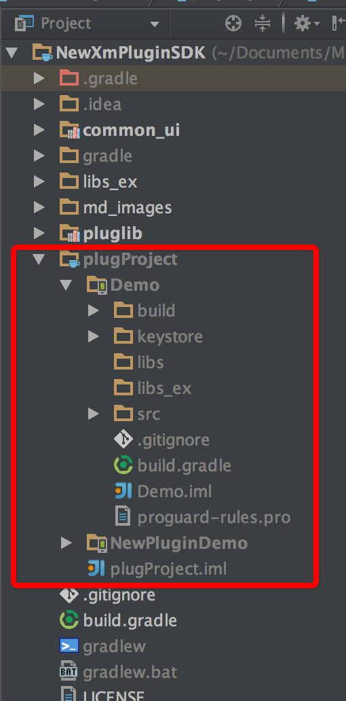
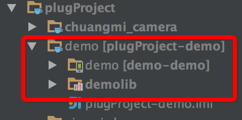
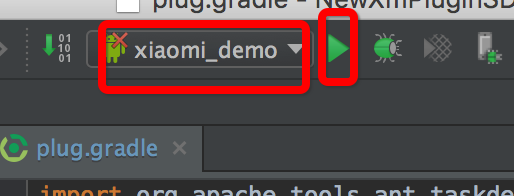
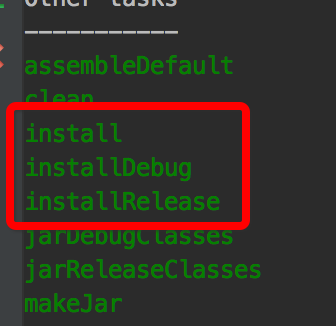
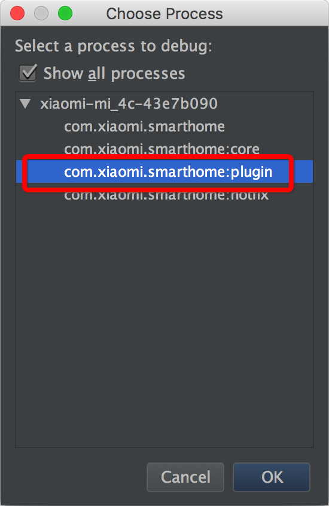

# 新版小米智能家庭Android app免安装插件开发手册


## 最新修改
- 添加使用帮助接口
```
IXmPluginHostActivity
    /**
     * ApiLevel:22 跳转到帮助页面
     */
    public abstract void openHelpActivity();

```
- 分享权限控制
```
类BaseDevice ApiLevel:20
分享的设备
public boolean isShared()
只读分享的设备，不能控制，兼容旧版同时isShared()返回true
public boolean isReadOnlyShared()
```
- 插件运行独立进程，退出插件后30s，自动退出插件进程
- 新版插件sdk使用Android studio开发
- 自动生成插件工程脚本gen_plug.py
- 执行gradle install自动安装插件并启动app

----


## 插件开发

### 开发前准备工作
- 登陆[智能家庭开放平台](https://open.home.mi.com)
- 申请开发者账号userid
- 登记新产品,记录设备model
- 创建签名证书
- 创建插件信息，提交证书md5信息

```
签名文件的md5信息获取，需要去掉:号

keytool -list -v -keystore  keyFilePath -storepass keypassword  -keypass  keypassword
```

### 安装开发版智能家庭app

智能家庭应用商店版的app不支持本地开发调试，需要安装sdk目录下的智能家庭app
 
### 工程目录结构

- [github](https://github.com/MiEcosystem/NewXmPluginSDK)更新SDK代码

- 插件工程放置于plugProject目录下，如下图，可以放置多个插件工程，注意插件工程目录结构
也可以在plugProject目录下直接管理其他git创库工程，比如插件实例工程[NewPluginDemo](https://github.com/MiEcosystem/NewPluginDemo)，在plugProject目录下直接clone即可

```
cd plugProject
git clone https://github.com/MiEcosystem/NewPluginDemo.git
```



### 旧版sdk插件工程迁移到新sdk

执行sdk目录下python脚本move_plug.py如下

```
python move_plug.py oldPlugPath
```

### 创建新插件工程
- 执行SDK目录下python脚本gen_plug.py

```
python gen_plug.py model userid
```

### 配置插件签名文件
所有插件在智能家庭app上运行时需要进行签名验证
- 修改插件工程build.gradle的签名信息

```
    signingConfigs {
        release {
            storeFile new File("${project.projectDir}/keystore/key.keystore")
            storePassword 'mihome'
            keyAlias 'mihome-demo-key'
            keyPassword 'mihome'
        }
    }

    buildTypes {
        debug {
            debuggable true
            signingConfig signingConfigs.release
        }
        release {
            minifyEnabled true
            shrinkResources false
            zipAlignEnabled true
            proguardFiles getDefaultProguardFile('proguard-android.txt'), 'proguard-rules.pro'
            signingConfig signingConfigs.release
        }
    }
```

### 配置插件编译脚本

- 修改插件工程build.gradle，末尾添加

```
apply from: "${project.rootDir.absolutePath}/plug.gradle"

```

### 添加插件依赖项目
如果插件有其他的项目依赖，添加到complieProject属性中，如下

```
project.ext.set("complieProject",[":demolib"])
```
依赖项目结构如下



依赖jar库和native so放置于libs目录下

### 插件编译运行

- 通过Android studio编译运行

在工具栏选中运行的插件项目，点击Run按钮，如下图所示




- 通过gradle指令编译运行，在插件sdk目录下执行

```
gradle tasks
```
可以看到安装插件task，如下图所示



```
gradle install 安装运行release配置插件
gradle installRelease 安装运行release配置插件
gradle installDebug 安装运行debug配置插件

如果有多个插件工程，上面指令会安装所有插件，指定安装某个插件工程,比如插件Xiaomi_demo

gradle installXiaomi_demo 安装运行release配置插件
gradle installXiaomi_demoRelease 安装运行release配置插件
gradle installXiaomi_demoDebug 安装运行debug配置插件
```

### 调试插件
安装上插件后，会自动启动智能家庭app，点击android studio 调试按钮，选择com.xiaomi.smarthome:plugin进程，如下图所示按钮，可以在插件代码中打断点调试



### 上传插件到智能家庭后台，申请上线

开发完成后，测试通过，可以申请上线，编译好的安装包插件目录/build/outputs/apk下面
除了功能测试通过，必须要注意进行内存测试，原则上在退出插件页面后，插件需要退出所有的后台线程，释放所有的内存资源，特别是Activity对象的内存泄露
上线审核前，会专门针对这两项测试。


## 插件实例测试

[插件实例工程](https://github.com/MiEcosystem/NewPluginDemo)
智能家庭app测试账号，安装完插件后，点击小米开发板设备，可以看到实例效果
```
用户名:923522198
密码:123asdzxc
```

## 其他链接

- [框架描述](框架描述.md)
- [服务器部署](服务器部署.md)
- [插件开发](插件开发.md)
- [开发接口描述](开发接口描述.md)
- [蓝牙规范](智能家庭蓝牙规范.md)
- [插件实例工程](https://github.com/MiEcosystem/NewPluginDemo)


## 开发遇到问题

- 插件里边尽量避免和common_ui里边同名资源名，否则插件中的资源会替换掉common_ui里边资源
- androi-support-*.jar库不需要插件引入，已经在公共配置中加入
- 插件中用到和app相同的库，目前最新开发版app已经解决这个问题，线上app，还是需要保持库版本一致，而且不要混淆

------

开发联系方式
qq:276111321
