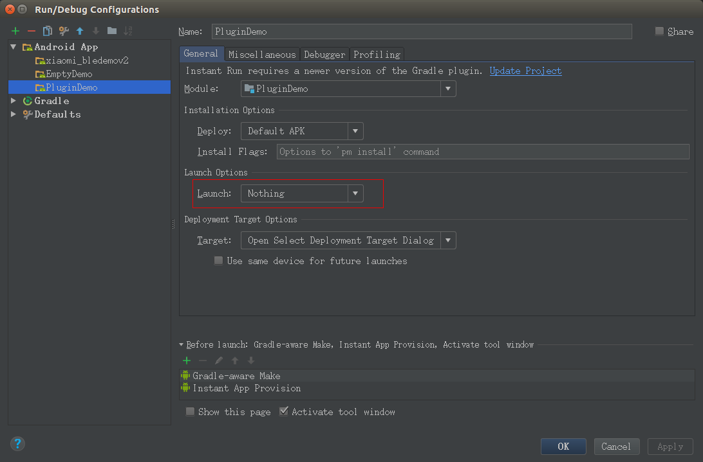
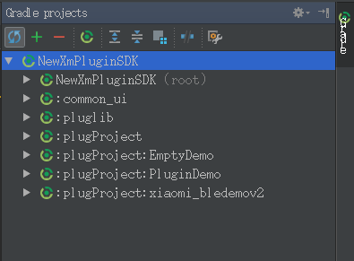
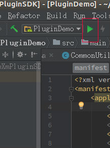
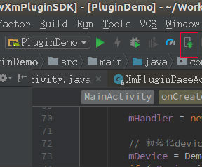
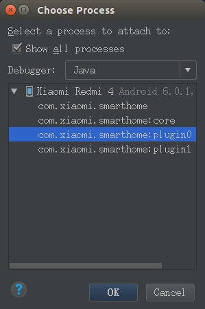
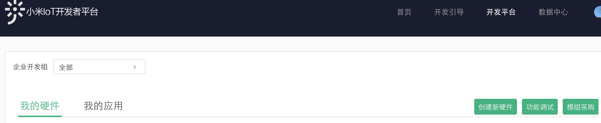
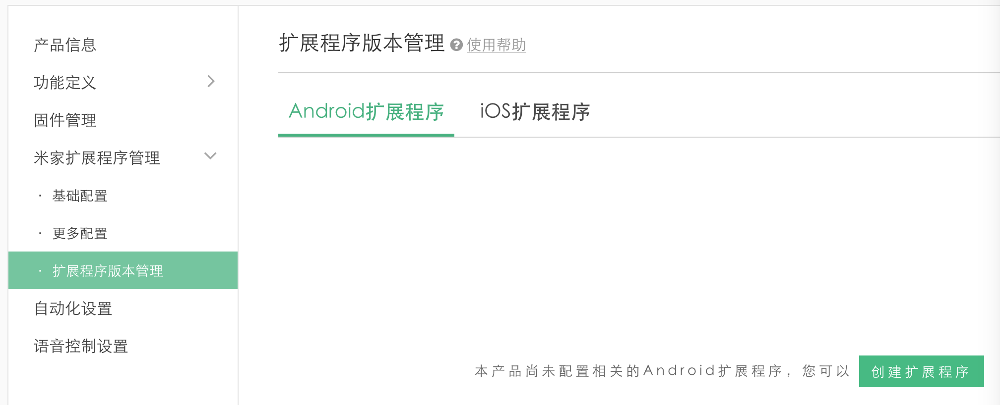
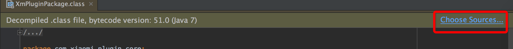
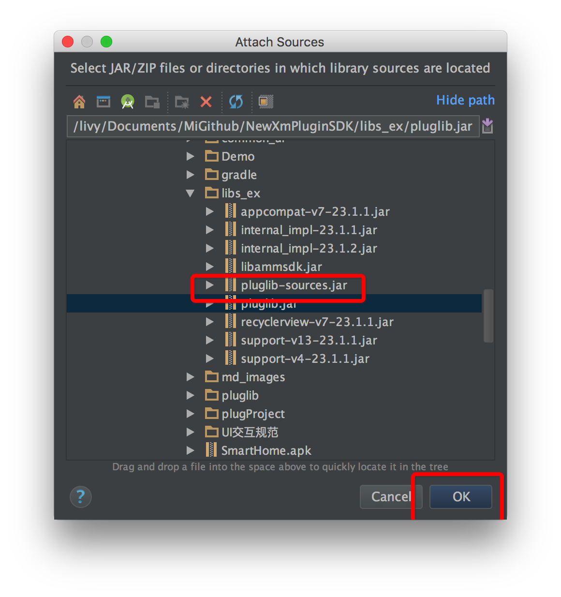

# 米家扩展程序（原插件）Android开发手册
[Github项目主页](https://github.com/MiEcosystem/NewXmPluginSDK)

[Wiki](https://github.com/MiEcosystem/NewXmPluginSDK/wiki)

# 目录
- [概要](#概要)
- [changelog](#changelog)
- [目录结构及文件含义](#目录结构及文件含义)
- [功能模块文档](#功能模块文档)
- [米家扩展程序示例代码](#米家扩展程序示例代码)
- [开发新的米家扩展程序](#开发新的米家扩展程序)
- [测试米家扩展程序](#测试米家扩展程序)
- [上传米家扩展程序](#上传米家扩展程序)
- [开发注意事项](#开发注意事项)
- [开发遇到的问题](#开发遇到的问题)

# 概要

NewXmPluginSDK是为已接入米家APP的智能设备提供的米家扩展程序Android开发环境，里面包含米家APP提供给扩展程序的各种功能API，以及常用的UI组件。米家扩展程序也是基于Android环境开发的，开发扩展程序的时候请确保Android配置信息（比如compileSdkVersion、minSdkVersion、targetSdkVersion）与米家最新版本保持一致。

**米家APP最新版本：5.4.5**

**米家APP最新API Level：75**

**米家APP compileSdkVersion：27**

**米家APP minSdkVersion：15**

**米家APP targetSdkVersion：25**

**文档修改日期：2018-8-20**

**本文档描述了米家扩展程序Android客户端的申请、创建、开发、调试的流程，更多内容详见下列文档，遇到问题先查看[Wiki](https://github.com/MiEcosystem/NewXmPluginSDK/wiki)**

# changelog
记录关键的sdk修改提交：

1）2018-6-22：在XmPluginHostApi类中新添加了一个接口checkAndRequestPermisson（API Level 75），用于扩展程序检查/请求所用到的Android权限。米家APP已经将targetSdkVersion升级到了25，如果扩展程序调用未经授权的Android相关权限功能，会导致扩展程序崩溃异常退出。

# 目录结构及文件含义

* gen_plug.py
	* 自动生成米家扩展程序工程脚本
* MiJiaAuthSDK
	* 提供米家Auth授权SDK
* mibtservice
	* 当设备运行的是Android系统的时候，此SDK给设备提供米家标准蓝牙通信协议，并且封装RPC、获取米家APP设备属性等功能
* common_ui
	* 封装了一些通用的米家UI组件，米家扩展程序可以使用(扩展程序工程可通过plug.gradle脚本添加引用，不需要直接引用)
* libs_ex
	* 提供了一些通用的第三方sdk，比如appcompat-v7、support-v4、support-v13、recyclerview、微信sdk等，米家扩展程序开发的时候不需要在自己的工程中重复引用这些第三方sdk(扩展程序工程可通过plug.gradle脚本添加引用，不需要直接引用)
* pluglib
	* 封装了米家APP提供给扩展程序的各种api(扩展程序工程可通过plug.gradle脚本添加引用，不需要直接引用) 
* plugProject
	* 提供了一些Demo工程，米家扩展程序开发的时候可以参考
	* 第三方自己开发的米家扩展程序工程也可以放置在此目录下
* plug.gradle
	* 封装了common\_ui、libs\_ex、pluglib工程的引用，米家扩展程序只需要在自己的build.gradle脚本中添加`apply from: "${project.rootDir.absolutePath}/plug.gradle"`就可以自动依赖了
	* 米家扩展程序的调试安装也是在该脚本实现
* 米家调试APK下载地址.md
	* 包含最新的米家调试APK下载地址，米家扩展程序开发调试的时候请使用此调试apk，不要使用线上版本的米家APP，另外调试的时候务必关闭应用商店的自动升级功能，避免调试apk被覆盖
* md_image
	* 存放SDK使用文档中引用到的图片，米家扩展程序开发可忽略

# 功能模块文档
* [米家扩展程序框架描述](米家扩展程序框架描述.md)
	* 整体描述了米家扩展程序Android端的原理 
* [米家扩展程序开发入门](米家扩展程序开发入门.md)
	* 整体描述了开发一个米家扩展程序的具体细节
* [API开发文档](API开发文档/README.md)
	* 详细描述了米家扩展程序开发中可以使用哪些米家APP提供的API

# 米家扩展程序示例代码

plugProject目录下包含了米家扩展程序示例工程，可供扩展程序开发参考：

* EmptyDemo
	* 演示了最基本空的米家扩展程序工程，用于了解米家扩展程序的基本结构
* xiaomi_bledemov2
	* 演示了蓝牙锁相关API
* PluginDemo
	* 演示了给米家扩展程序提供的大部分UI组件以及相关功能API
	* 安装完示例米家扩展程序后，点击小米开发板设备，可以看到实例效果
	* 说明：必须得使用米家APP测试账号才能运行示例米家扩展程序，测试账号如下：
     `用户名:923522198`, `密码:123asdzxc`

## 运行和调试PluginDemo米家扩展程序

说明：如果要调试某个设备的米家扩展程序，**必须在米家APP中已经添加了这个设备**，否则没法调试。

1. 从[github](https://github.com/MiEcosystem/NewXmPluginSDK)下载NewXmPluginSDK工程

1. 安装工程根目录下提供的米家调试APK

	应用商店版本米家APP是没有办法调试米家扩展程序的，只能安装工程根目录下单独提供的米家调试APK

1. 使用测试账号登录

	打开米家APP，登录如下测试账号：`用户名:923522198`, `密码:123asdzxc`

	这个测试账号里已经添加了“小米开发板”这个设备，下面演示如何调试这个设备的米家扩展程序。

1. Android Studio打开下载的NewXmPluginSDK工程

1. 按照如下步骤修改米家扩展程序功能的配置

	说明：米家提供的米家扩展程序工程是没有Launch Activity的，Android Studio默认会提示错误，没法直接Run/Debug米家扩展程序工程，因此需要修改下Android Studio配置。

	1）点击Edit Configurations打开配置页面

	

	2）点击Android App下的PluginDemo一项，找到Launch Options，把Launch选项改为Nothing，然后点击“OK”保存退出

	

	3）同步Gradle

	

1. 通过USB线连接手机和电脑

	确保手机已经打开了USB调试开关，并且同意当前电脑连接手机。

1. 运行PluginDemo米家扩展程序

	有两种方法运行米家扩展程序：

	1）通过Android Studio直接Run

	

	2）通过命令行运行米家扩展程序

	通过gradle指令编译运行，在NewXmPluginSDK根目录下命令行执行：
	
	```
	PluginDemo为米家扩展程序工程名
	./gradlew installPluginDemoDebug 安装运行debug配置米家扩展程序
	./gradlew installPluginDemoRelease 安装运行release米家扩展程序
	```

	通过上述两种方式运行米家扩展程序的时候，会通过命令行重启米家APP（运行过程中米家APP会退出重新再进一次，这是正常现象）。如果运行成功，会先弹“从SD卡读取成功”的Toast，然后再弹“安装成功”的Toast。这个时候再点击进入“小米开发板”这个设备，运行的就是当前工程下的PluginDemo米家扩展程序，而不是云端下发的米家扩展程序。
	
	注意：本地运行米家扩展程序成功后，更新的只是本地的扩展程序；如果要更新云端的扩展程序，还需要到小米Iot开放平台上传新的扩展程序。

	> 如何确定米家扩展程序内容更新成功，替换了云端下发的默认米家扩展程序？
	>
	> 一个小技巧就是，在PluginDemo工程MainActivity的onCreate里打印一些Log或者是Toast弹出一些信息，如果进入设备的时候打印或Toast出了相关信息就说明米家扩展程序本地替换成功了。

1. 调试PluginDemo米家扩展程序

	可以像调试Android App一样调试米家扩展程序。

	1）安装上米家扩展程序后，会自动启动米家APP，点击Android Studio调试按钮：
	
	

	2）选择com.xiaomi.smarthome:plugin0进程(如果不行，选择com.xiaomi.smarthome进程调试)，如下图所示按钮：

	

	3）然后就可以在米家扩展程序代码中打断点调试了。

# 开发新的米家扩展程序

## 开发前准备工作
1. 登陆[小米IoT开放平台](https://iot.mi.com)
1. 申请开发者账号developerId
1. 登记新产品，记录设备model
   
   按照下图所示，点击“创建新硬件”：
   
   

1. 创建Android扩展程序

	创建好新产品后，在“我的硬件”页面点击新创建产品的“开发”按钮，进入下图所示页面，然后按图所示点击“创建扩展程序”后即可配置Android扩展程序，再后面就按照提示输入开发者developerId、扩展程序包名等信息：
	
	

1. 创建签名证书
   
	创建方式：就是通用的Android APK签名证书生成方式。

1. 创建米家扩展程序信息，提交证书md5信息

	```
	签名文件的md5信息获取，需要去掉:号
	说明：不要使用Java10版本的keytool，使用Java8及以下版本的keytool
	
	keytool -list -v -keystore  keyFilePath -storepass keypassword  -keypass  keypassword
	```

	证书md5信息详细提交方式：

	1）使用上述申请developerId的账号登录[小米IoT开放平台](https://iot.mi.com)

	2）点击右上角个人信息页面，打开个人开发者页面

	3）在个人开发者页面的“扩展程序公钥”框输入上述md5信息

1. 配置账号白名单
	
	如果开发者如果不是用注册开发者的小米账号登录的话，需要把当前的小米账号配置成协作开发或者测试白名单：
	

1. 安装开发版米家APP

	米家应用商店版的APP不支持本地开发调试，需要安装sdk目录下的米家调试APP。
	
## 开发米家扩展程序
1. 从[github](https://github.com/MiEcosystem/NewXmPluginSDK)更新SDK代码
	
	米家扩展程序工程放置于plugProject目录下，如下图，可以放置多个米家扩展程序工程：
	

1. 创建新的米家扩展程序工程
	
	在SDK根目录下执行python脚本gen_plug.py（执行完后会在plugProject目录下自动生成最简单的米家扩展程序工程）：
	
	注意：
	
	1）model为创建新硬件时配置的
	
	2）developerId为申请的小米开发者账号（小米账号），不是手机号码
	
	3）packageName为创建Android扩展程序时配置的包名（**针对Android包名，禁止出现Java关键字（[关键字列表](https://docs.oracle.com/javase/tutorial/java/nutsandbolts/_keywords.html)），开关类产品需特别注意**）
	
	```
	python gen_plug.py model developerId packageName
	```

	创建了米家扩展程序工程后，需要同步下NewXmPluginSDK工程的gradle信息，不然新的米家扩展程序模块有可能没刷新显示出来：
	
	

1. 配置米家扩展程序签名文件
	
	**通过gen_plug.py脚本生成新的米家扩展程序工程时，会在keystore目录下生成一个示例的key.keystore，这个只是作为示例使用，为了安全，实际扩展程序开发中需要替换成自己的签名文件。**
	
	所有米家扩展程序在米家APP上运行时需要进行签名验证，修改米家扩展程序工程build.gradle的签名信息：
	
	```
	defaultConfig {
	    // minSdkVersion和targetSdkVersion必须与米家APP保持一致，如果minSdkVersion设置过高，则米家扩展程序无法在低版本Android平台下载安装
        minSdkVersion 15
        targetSdkVersion 19
    }
    signingConfigs {
        release {
            storeFile new File("${project.projectDir}/keystore/key.keystore")
            storePassword 'mihome'
            keyAlias 'mihome-demo-key'
            keyPassword 'mihome'
        }
    }
	
    buildTypes {
        debug {
            debuggable true
            signingConfig signingConfigs.release
        }
        release {
            minifyEnabled true
            shrinkResources false
            zipAlignEnabled true
            proguardFiles getDefaultProguardFile('proguard-android.txt'), 'proguard-rules.pro'
            signingConfig signingConfigs.release
        }
    }
	```
1. 配置米家扩展程序编译脚本
	
	修改米家扩展程序工程build.gradle，末尾添加：
	
	```
	apply from: "${project.rootDir.absolutePath}/plug.gradle"
	
	```

1. 添加米家扩展程序依赖项目

	如果米家扩展程序有其他的项目依赖，添加到complieProject属性中，如下：
	
	```
	project.ext.set("complieProject",[":demolib"])
	```
	依赖项目结构如下：
	
	
	
	依赖jar库和native so放置于libs目录下。

1. 关联pluglib库源码

	米家扩展程序开发的时候，发现pluglib中的函数变量名被重命名，没有注释，可以通过下面方法关联pluglib源码看到源码中的注释和变量名。
	
	先点击系统反编译源码文件的右上角：
	
	
	
	然后选择libs_ex下的pluglib-sources.jar：
	
	

1. 依赖其他jar包
	
	如果想依赖其他jar的话，不需要修改gradle，直接将jar放入./libs目录下面。

# 测试米家扩展程序

***再次说明下：必须在米家APP中已经了添加了某个设备后，才能调试运行这个设备的米家扩展程序，不然没法调试运行米家扩展程序。***

1. 有真实的设备测试：
	
	1）米家APP中扫描设备；
	
	2）连接设备（不同设备连接过程可能不一样，按照提示引导进行）；
	
	3）连接成功后就可以进入米家扩展程序进行功能测试了；

	4）米家扩展程序的调试可以参考上述PluginDemo工程进行。

1. 暂时没有真实设备：
	
	如果开发者暂时没有真实的设备，想跳过连接过程直接打开米家扩展程序，可以添加一个虚拟的设备到米家APP中调试米家扩展程序。
	
	在米家APP里选中“我的” -> "设置" -> "开发者选项"中打开“是否开启无设备开发模式”。
	
	然后点击米家APP首页右上角的"+"按钮进入添加设备页面，再点击"手动添加"按钮，长按要调试的设备，即可进入设备添加页面，点击"添加"按钮，就可以添加一个虚拟的设备到米家APP了。这个虚拟的设备只能用来调试UI功能，如果要调试设备连接或设备信息获取相关功能，只能添加真实的设备后再进行。

	如果在手动添加打开的页面没有看所要调试的设备，确认下：

	1）在[小米IoT开放平台](https://iot.mi.com)米家扩展程序已经创建成功；
	
	2）打开[开发引导](https://iot.mi.com/guide.html#id=60)页面，选中“平台使用指南”，再点击“智能硬件直连接入”，最后点击“Step 3: 配置功能物料”，参考文中的基础配置；

	3）当前账号已经添加到了白名单里;
	
	4）需要在[小米IoT开放平台](https://iot.mi.com)有上传扩展程序(首次开发，上传一个内容为空的扩展程序也可以)，否则的话会提示添加失败。


# 上传米家扩展程序

米家扩展程序开发完成，测试通过后，可以到米家后台申请上线，编译好的安装包在对应米家扩展程序工程/build/outputs/apk下面。注意：上传的扩展程序APK必须要正式签名，而且签名文件要与在开发者平台提交的签名信息一致。

除了功能测试通过，必须要注意进行内存测试，原则上在退出米家扩展程序页面后，米家扩展程序需要退出所有的后台线程，释放所有的内存资源，特别是Activity对象的内存泄露
上线审核前，会专门针对这两项测试。

**在米家扩展程序的测试和发布过程中如有其它疑问可联系米家的工作人员。**

# 开发注意事项

1. 米家扩展程序默认需要支持中英文：

   1）英文资源放到/res/values下；
   
   2）中文资源放到/res/values-zh/下。

# 开发遇到的问题

- 米家扩展程序里边尽量避免和common_ui里边同名资源名，否则米家扩展程序中的资源会替换掉common\_ui里边资源
- 暂时不支持Serializable，相关需求的话请用Parcelable代替
- androi-support-*.jar库不需要米家扩展程序引入，已经在公共配置中加入
- **更多其它问题可查看[Wiki](https://github.com/MiEcosystem/NewXmPluginSDK/wiki)**


