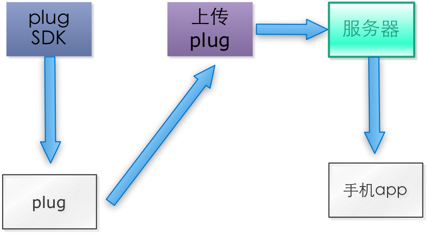

# 插件框架描述

------

> * 提供给第三方plug SDK，基于plug SDK开发设备界面和业务逻辑。
> * 开发完成后生成apk并签名，提交服务器审核。
> * 审核通过，上线。
> * 手机米家app，实时更新plug应用。

------
米家app：从后台下载插件应用，并运行插件应用。

plug SDK：提供给第三方开发需要集成到智能家庭app中智能设备插件应用。

插件应用：基于plug SDK开发的Android apk文件，包括一种类型的智能设备整个业务逻辑。

------

<!-- create time: 2015-04-17 10:57:59  -->
