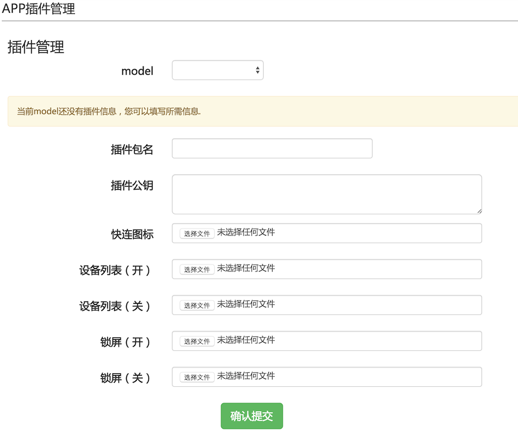
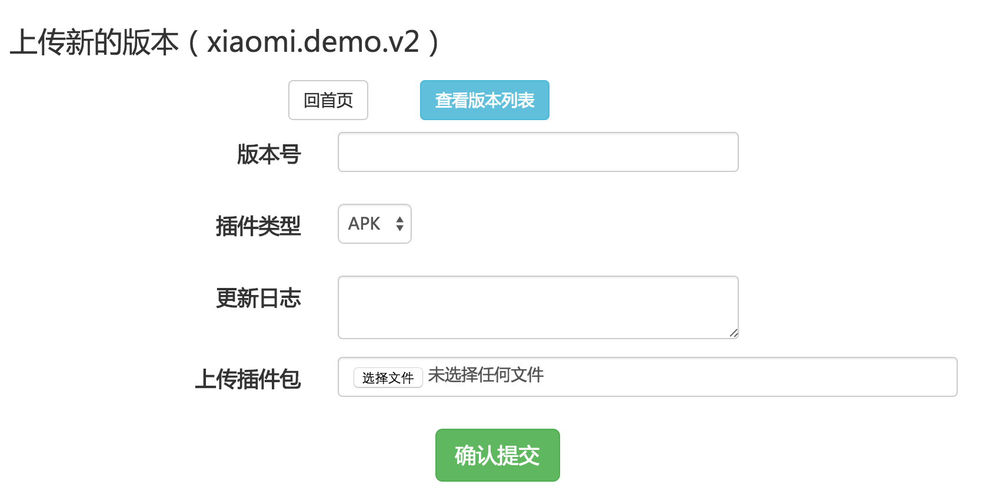

# 服务器部署

------
## 插件配置

 

* `model`
* `插件主包名`
* `插件公钥`: 证书的MD5值
* `快连图标`: 设备快连时显示的图标文件(140*140)
* `设备列表(开)`: 设备列表中表示设备开启的图标文件(140*140)
* `设备列表(关)`: 设备列表中表示设备关闭的图标文件(140*140)
* `锁屏(开)`: 锁屏页面表示设备开启的图标文件(140*140)
* `锁屏(关)`: 锁屏页面表示设备关闭的图标文件(140*140)

------
## 打包
使用与配置信息中`插件公钥`对应的证书和私钥签名apk包

------
##调试
1. 安装智能家庭App
2. 使用智能家庭App完成插件设备的快连和绑定
3. 编译插件生成apk
4. 拷贝apk到XmPlugTest工程assests下面
5. 点击智能家庭App中设备列表的插件设备进入插件
6. 可以通过断点调试XmPlugTest来调试插件加载和运行

------
##发布插件包

 

* `版本号`: versionCode
* `插件类型`: APK
* `更新日志`: changeLog
* `上传插件包`: 插件包文件
