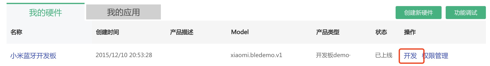
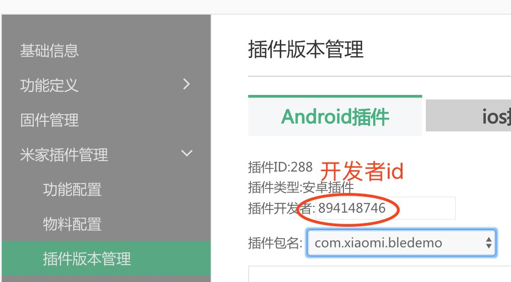

# 米家扩展程序开发入门

## 创建米家扩展程序
参考[README](README.md)开发新的米家扩展程序这一节。
## AndroidManifest.xml文件application下添加米家扩展程序配置和入口

* 必须设置model和message_handler，提供米家扩展程序运行的android sdk版本号

	```
	<!-- 支持米家扩展程序的米家APP最低API Level版本，必须 -->
	<meta-data android:name="minPluginSdkApiVersion" android:value="1" />
	<!-- 设备model，必须 -->
	<meta-data android:name="model" android:value="xiaomi.demo.v1" />
	<!-- 设备处理消息入口，必须 -->
	<meta-data android:name="message_handler" android:value="com.xiaomi.xmplugindemo.MessageReceiver" />
	<!-- 开发者Id, 必须 -->
	<meta-data android:name="MiHomeDeveloperId" android:value="id_894148746" />
	<!-- 支持的运行平台,必须 -->
	<meta-data android:name="MiHomePlatform" android:value="phone" />
	```
* 如何获取开发者Id

打开[米家智能平台](https://open.home.mi.com)，点击“开发平台”，然后：




## 创建MessageReceiver类，继承IXmPluginMessageReceiver，入口函数

类名必须保持和AndroidManifest.xml中配置message_handler一致


```
public class MessageReceiver implements IXmPluginMessageReceiver {
    public static final String MODEL = "xiaomi.demo.v1";

    @Override
    public boolean handleMessage(Context context, XmPluginPackage xmPluginPackage, int type,
                                 Intent intent,
                                 DeviceStat deviceStat) {
        switch (type) {
            case LAUNCHER: {// 启动入口
                XmPluginHostApi.instance().startActivity(context, xmPluginPackage, intent,
                        deviceStat.did, MainActivity.class);
                return true;
            }

            default:
                break;
        }
        return false;
    }

    @Override
    public boolean handleMessage(Context context, XmPluginPackage xmPluginPackage, int type,
                                 Intent intent, DeviceStat deviceStat, MessageCallback callback) {
        // TODO Auto-generated method stub
        return false;
    }

}
```
handleMessage中除了可以处理LAUNCHER消息外，还可以处理其他类型的消息，这个根据自己的产品需求来进行。目前支持的所有消息类型如下：

* LAUNCHER
	* 入口消息，APILevel：1 
* PUSH_MESSAGE
	* push消息，APILevel：2 
* MSG\_PAGE\_NAVIGATE
	* 页面跳转，APILevel：3
* MSG\_BROADCAST\_BLUETOOTH\_DEVICE\_ACTION\_ACL\_CONNECTED
	* 系统蓝牙广播ACL_CONNECTED，APILevel：6
* MSG\_BROADCAST\_BLUETOOTH\_DEVICE\_ACTION\_ACL\_DISCONNECTED
	* 系统蓝牙广播ACL_DISCONNECTED，APILevel：7
* MSG\_BLUETOOTH\_PAIRING
	* 蓝牙配对，APILevel：8
* MSG\_BLUETOOTH\_DISCONNECT
	* 蓝牙断开连接，APILevel：9
* MSG\_SCENE\_GET\_CONDITION\_EXTRA
	* 获取场景自定义条件中的extra字段，APILevel：10
* MSG\_UPNP\_CONNECT
	* UPNP设备已连接，APILevel：12
* MSG\_UPNP\_DISCONNECT
	* UPNP设备连接断开，APILevel：13
* MSG\_SET\_SCENE\_LARGE\_EXTRA
	* 设置超长场景extra，APILevel：14
* MSG_BROADCAST
	* 接收broadcast消息，APILevel：15
* MSG\_UPNP\_EVENT
	* UPNP设备事件，APILevel：16
* MSG\_NOTIFICATION\_PENDING\_INTENT
	* 通知栏点击事件，APILevel：17
* MSG\_INIT\_CAMERA\_FRAME\_SENDER
	* 初始化请求通道，APILevel：18
* MSG\_STAR\_REQUEST\_CAMERA\_FRAME
	* 请求相机数据，APILevel：19
* MSG\_STOP\_REQUEST\_CAMERA\_FRAME
	* 停止发送数据，APILevel：20
* MSG\_DESTROY\_REQUEST\_CAMERA\_FRAME
	* 销毁发送通道，APILevel：21
* MSG\_BLE\_CHARACTER\_CHANGED
	* 注册底层ble蓝牙数据监听，当收到数据时发送此msg给米家扩展程序，APILevel：22

## 创建Device继承BaseDevice，封装设备的状态和rpc调用

* 创建Device类：

	```
	// 封装设备功能处理
	public class Device extends BaseDevice {
	    // 缓存设备状态数据，每次进入不需要立即更新数据
	    private static ArrayList<Device> DEVICE_CACHE = new ArrayList<Device>();
	
	    // 先从缓存中获取Device，并更新DeviceStat
	    public static synchronized Device getDevice(DeviceStat deviceStat) {
	        for (Device device : DEVICE_CACHE) {
	            if (deviceStat.did.equals(device.getDid())) {
	                device.mDeviceStat = deviceStat;
	                return device;
	            }
	        }
	
	        Device device = new Device(deviceStat);
	        DEVICE_CACHE.add(device);
	        return device;
	    }
	
	    // 通过did获取Device
	    public static synchronized Device getDevice(String did) {
	        for (Device device : DEVICE_CACHE) {
	            if (did.equals(device.getDid())) {
	                return device;
	            }
	        }
	        return null;
	    }
	
	    public Device(DeviceStat deviceStat) {
	        super(deviceStat);
	    }
	}
	```
* 在Activity中初始化device

	```
	Device mDevice = Device.getDevice(mDeviceStat);
	```
* Device提供的方法

	```
	/**
	 * 添加状态监听
	 * 
	 * @param listener
	 */
	public void addStateChangedListener(StateChangedListener listener);
	    
	/**
	 * 移除状态监听
	 * 
	 * @param listener
	 */
	public void removeStateChangedListener(StateChangedListener listener)
	    
	/**
	 * 设备方法调用
	 * 
	 * @param method 方法名
	 * @param param 参数，可以是一个集合Collection子类
	 * @param callback 回调结果
	 * @param parser
	 */
	public <T> void callMethod(String method, Object[] params,
	        final Callback<T> callback, final Parser<T> parser) {
	    XmPluginHostApi.instance().callMethod(getDid(), method, params, callback, parser);
	}
	
	/**
	 * 设备方法调用
	 * 
	 * @param method 方法名
	 * @param param
	 * @param callback 回调结果
	 * @param parser
	 */
	public <T> void callMethod(String method, JSONArray params,
	        final Callback<T> callback, final Parser<T> parser) {
	    XmPluginHostApi.instance().callMethod(getDid(), method, params, callback, parser);
	}
	    
	/**
	 * 设备方法调用
	 * API level: 29
	 *
	 * @param method 方法名
	 * @param params
	 * @param callback 回调结果
	 * @param parser
	 */
	public <T> void callMethod(String method, JSONObject params,
	                           final Callback<T> callback, final Parser<T> parser);
	                           
	 /**
	 * 获取设备固件升级信息
	 */
	public void checkDeviceUpdateInfo(final Callback<DeviceUpdateInfo> callback);
	    
	/**
	 * 返回设备id
	 */
	public String getDid();
	    
	/**
	 * 返回设备名字
	 */
	public String getName();
	    
	/**
	 * 返回设备ip
	 */
	public String getIp();
	    
	/**
	 * 返回设备mac地址
	 */
	public String getMac();
	    
	/**
	 * 返回model
	 */
	public String getModel();
	    
	/**
	 * 返回分享设备的parentId
	 */
	public String getParentId();
	    
	/**
	 * 返回分享设备的parentModel
	 */
	public String getParentModel();
	    
	/**
	 * 获取绑定标志，BIND_FLAG_UNSET: 0，BIND_FLAG_SET: 1
	 */
	public int getBindFlag();
	    
	/**
	 * 获取认证标志，AUTH_FLAG_SET: 0，AUTH_FLAG_SET: 1
	 */
	public int getAuthFlag();
	    
	/**
	 * 是否是子设备，仅支持二级子设备
	 */
	public boolean isSubDevice();
	    
	/**
	 * 获取当前设备token
	 */
	public String getToken();
	    
	/**
	 * ApiLevel:10 是否主人设备
	 */
	public boolean isOwner();
	    
	/**
	 * ApiLevel:10 是否家庭设备
	 */
	public boolean isFamily();
	    
	/**
	 * ApiLevel:10 是否是分享权限,默认是可以控制
	 */
	public boolean isShared();
	    
	    
	/**
	 * ApiLevel:10 是否绑定设备，无论哪种权限，主人，分享，家庭都算
	 */
	public boolean isBinded2();
	    
	/**
	 * ApiLevel:20 是否是只读分享权限，如果设备支持微信分享，必须要检查这个选项，在米家扩展程序中不能让用户控制设备
	 */
	public boolean isReadOnlyShared();
	    
	```

## 创建Activity，继承XmPluginBaseActivity

米家扩展程序内的Activity必须是XmPluginBaseActivity子类，才能被启动

## 设置titlebar在顶部透明显示时的顶部padding
```
mHostActivity.setTitleBarPadding(findViewById(R.id.title_bar));
```
## activiy中需要返回调用结果必须如下调用
```
activity().setResult(RESULT_OK);
```

## 在米家扩展程序Activity中凡是需要使用Context上下文对象参数的，必须使用activity()

显示Toast

```
Toast.makeText(activity(), “test”, Toast.LENGTH_SHORT).show();
```

显示Dialog

```
MLAlertDialog.Builder builder = new MLAlertDialog.Builder(activity());
builder.setTitle("测试Dialog");
builder.setPositiveButton("Ok", new MLAlertDialog.OnClickListener() {
    @Override
    public void onClick(DialogInterface dialog, int which) {
                            
    }
});
```

## 调用公共设备菜单界面
```
//点击菜单返回界面，需要在onActivityResult接收参数
ArrayList<String> menus = new ArrayList<String>();
menus.add("自定义菜单1");
    
//点击直接进入下一页
ArrayList<Intent> intents = new ArrayList<Intent>();
Intent intent =  mHostActivity.getActivityIntent(null, SettingActivity.class.getName());
intent.putExtra("menu", "设置");
intents.add(intent);
    
// 设置自定义菜单
mHostActivity.openMoreMenu(menus,intents, true, REQUEST_MENUS);
```
默认菜单操作已经封装统一处理，自定义的菜单在Activity接收并处理
```
public void onActivityResult(int requestCode, int resultCode, Intent data)
```

更详细的使用说明见：[API开发文档/公共设备菜单API](API开发文档/公共设备菜单API.md)

## 使用plug_common库中MenuDialog控件实现

```
MenuDialog menuDialog = new MenuDialog(activity());

//设置默认样式
public void setItems(CharSequence[] items, DialogInterface.OnClickListener listener) {
    this.mItems = items;
    this.onClickListener = listener;
}
//设置背景颜色
public void setBackGroundColor(int color){
    mBackgroundColor = color;
}
//设置可定制样式
public void setMenuAdapter(BaseAdapter adapter){
    mListViewAdapter = adapter;
}

```

## 调起创建场景界面
```
mHostActivity.startCreateSceneByCondition(mDevice.getDid(), "device");
```
## 启动米家扩展程序内Activity

```
startActivityForResult(null, FragmentActivity.class.getName(), 2);
```
或者

```
startActivity(null, SettingActivity.class.getName());
```
## 米家扩展程序finish 模拟singleTop和回退到设备列表
```
XmPluginBaseActivity.java

/**ApiLevel:14
 * 按照调用栈一直回退finish，直到lastActivityClass为止,当lastActivityClass为null会一直回退到设备列表
 * @param lastActivityClass
 */
public void finishParent(String lastActivityClass) {
  
}
```
## 加载native so
必须用下面的接口加载
```
XmPluginHostApi.instance().loadLibrary(“model”,”h264decoder",
                            getClassLoader());
```

## Fragment继承BaseFragment

提供下面方法可以使用XmPluginBaseActivity接口

```
public XmPluginBaseActivity xmPluginActivity() {
        return mXmPluginBaseActivity;
    }

// 米家扩展程序内启动activity
public void startActivityForResult(Intent intent, String className,
        int requestCode) {
    if (mXmPluginBaseActivity != null) {
        mXmPluginBaseActivity.startActivityForResult(intent, className, requestCode);
    }
}

```

## 商城一键购买


#### 链接参数

```
http://home.mi.com/shop/search?action={search,detail,check}&keyword={keyword}&source={packageName}

```

其中action有三种：

search表示搜索

detail表示去商品详情页

check表示一键购买

keyword为商品关键字

source为来源，一般使用包名


#### 一键购买摄像机实例如下：

```
Uri uri = Uri.parse("http://home.mi.com/shop/search?action=check&keyword=小蚁摄像头 夜视&source=com.xiaomi.smarthome​");
XmPluginHostApi.instance().gotoPage(activity(), mPluginPackage, uri, null);

```
