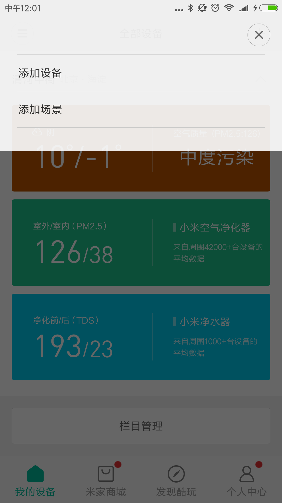
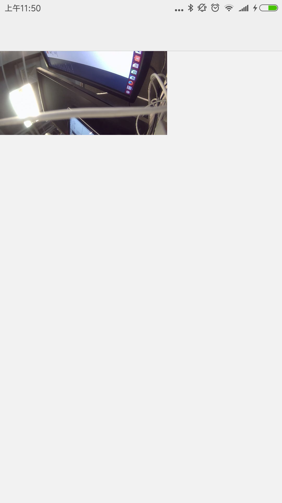

# 落地页视频接入

##更新MessageReceiver类，处理MSG_REQUEST_CAMERA_FRAME和MSG_STOP_CAMERA_FRAME
MSG_REQUEST_CAMERA_FRAME:开始请求视频流  
MSG_STOP_CAMERA_FRAME:断开视频流  
请求视频格式会在intent中  
int frameRate = intent.getIntExtra("request_frame_rate", 0); //0代表自动，1代表480p，2代表720p，3代表1080p


```
public class MessageReceiver implements IXmPluginMessageReceiver {
    public static final String MODEL = "xiaomi.demo.v1";

    @Override
    public boolean handleMessage(Context context, XmPluginPackage xmPluginPackage, int type,
                                 Intent intent,
                                 DeviceStat deviceStat) {
        switch (type) {
            case LAUNCHER: {// 启动入口
                XmPluginHostApi.instance().startActivity(context, xmPluginPackage, intent,
                        deviceStat.did, MainActivity.class);
                return true;
            }
            case MSG_REQUEST_CAMERA_FRAME: {
                //开始请求视频流数据，如果视频流已经开启，则需要根据intent调整视频格式
                CameraFrameManager.instance().startRequestData(xmPluginPackage, deviceStat, intent);
                return true;
            }

            case MSG_STOP_CAMERA_FRAME: {
                CameraFrameManager.instance().stopRequestData(xmPluginPackage, deviceStat);
                return true;
            }
            default:
                break;
        }
        return false;
    }

    @Override
    public boolean handleMessage(Context context, XmPluginPackage xmPluginPackage, int type,
                                 Intent intent, DeviceStat deviceStat, MessageCallback callback) {
        // TODO Auto-generated method stub
        return false;
    }

}
```
##实现发送逻辑
调用XmPluginHostApi实现发送逻辑  
在发送之前一定要调用initCameraFrameSender
```
    /**
     * ApiLevel: 34
     * 初始化相机发送通道
     */
    public abstract void initCameraFrameSender(String did);

    /**
     * ApiLevel: 34
     * 摄像机设备发送video接口
     */
    public abstract void sendCameraFrame(String did, byte[] data, long seq, int frameSize, long timestamp, int width, int height);

    /**
     * ApiLevel: 34
     * 关闭发送通道
     */
    public abstract void closeCameraFrameSender(String did);

```
##app验证方法

```
长按图中的添加设备按钮
```

```
如果视频加载成功，则成功接收到数据
